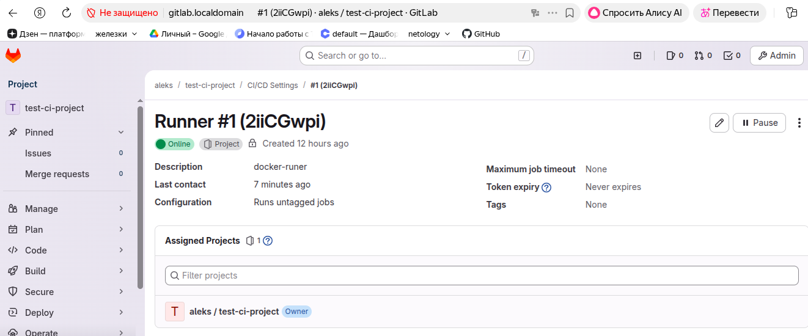
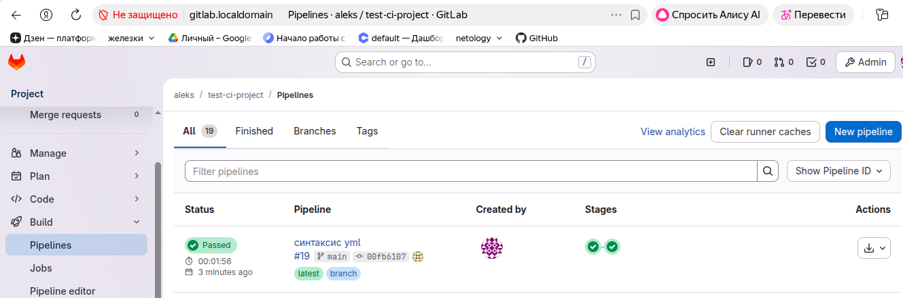

Домашнее задание к занятию "`GitLab`" - `Александр`  

## Задание 1

Что нужно сделать:

1. Разверните GitLab локально, используя Vagrantfile и инструкцию, описанные в этом репозитории.
2. Создайте новый проект и пустой репозиторий в нём.
3. Зарегистрируйте gitlab-runner для этого проекта и запустите его в режиме Docker. Раннер можно регистрировать и запускать на той же виртуальной машине, на которой запущен GitLab.
В качестве ответа в репозиторий шаблона с решением добавьте скриншоты с настройками раннера в проекте.

**Решение1:**  

## Задание 2

Что нужно сделать:

1. Запушьте репозиторий на GitLab, изменив origin. Это изучалось на занятии по Git.
2. Создайте .gitlab-ci.yml, описав в нём все необходимые, на ваш взгляд, этапы.

В качестве ответа в шаблон с решением добавьте:

. файл gitlab-ci.yml для своего проекта или вставьте код в соответствующее поле в шаблоне;
. скриншоты с успешно собранными сборками.

**Решение:**

# ========================================================
# GitLab CI/CD Pipeline Configuration
# Проект: Go Application CI/CD
# ========================================================

# --------------------------------------------------------
# Определение этапов выполнения pipeline
# Этапы выполняются последовательно в указанном порядке
# --------------------------------------------------------
stages:
  - test    # Этап 1: Запуск автоматических тестов
  - build   # Этап 2: Сборка приложения

# --------------------------------------------------------
# ЗАДАЧА: ТЕСТИРОВАНИЕ (test)
# Проверка корректности кода через unit-тесты
# --------------------------------------------------------
test:
  # Основные параметры задачи
  stage: test          # Относится к этапу "test"
  image: golang:1.17   # Использует Docker-образ Go версии 1.17
  
  # Выполняемые команды
  script:
    - go test .        # Запуск всех unit-тестов в текущей директории

# --------------------------------------------------------
# ЗАДАЧА: СБОРКА (build)
# Компиляция Go приложения
# --------------------------------------------------------
build:
  # Основные параметры задачи
  stage: build         # Относится к этапу "build"
  image: golang:1.17   # Для консистентности используем тот же образ Go
  
  # Выполняемые команды
  script:
    - go build .       # Компиляция Go приложения

# ========================================================
# КОНЕЦ КОНФИГУРАЦИИ
# ========================================================

